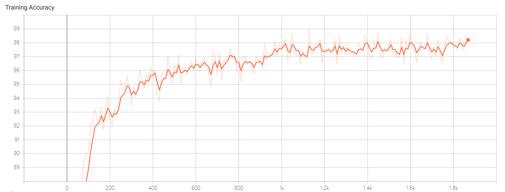

# Lab 1 - 框架及工具入门示例

## 实验报告
 

### 实验环境

||||
|--------|--------------|--------------------------|
|硬件环境|CPU（vCPU数目）  &nbsp;&nbsp;&nbsp;&nbsp;&nbsp;&nbsp;&nbsp;&nbsp;&nbsp;&nbsp;Intel(R) i5-9300H @2.40GHz(8线程)|&nbsp;&nbsp;&nbsp;&nbsp;&nbsp;&nbsp;&nbsp;&nbsp;&nbsp;|
||GPU(型号，数目) &nbsp;&nbsp;&nbsp;&nbsp;&nbsp;&nbsp;&nbsp;&nbsp;&nbsp;&nbsp; &nbsp;&nbsp;Nvidia GeForce RTX 2060(1个)
|软件环境|OS版本 &nbsp;&nbsp;&nbsp;&nbsp;&nbsp;&nbsp;&nbsp;&nbsp;&nbsp;&nbsp; &nbsp;&nbsp;&nbsp;&nbsp;&nbsp;&nbsp;&nbsp;&nbsp;&nbsp;&nbsp;&nbsp;&nbsp;&nbsp;&nbsp;&nbsp;&nbsp;&nbsp;&nbsp;Windows 10(64位)
||深度学习框架 python包名称及版本 &nbsp;&nbsp;&nbsp;&nbsp;&nbsp; &nbsp;&nbsp; Pytorch 1.15.0
||CUDA版本    &nbsp;&nbsp;&nbsp;&nbsp;&nbsp;&nbsp;&nbsp;&nbsp;&nbsp;&nbsp; &nbsp;&nbsp;&nbsp;&nbsp;&nbsp;&nbsp;&nbsp;&nbsp;&nbsp;&nbsp;&nbsp;&nbsp;&nbsp;&nbsp;&nbsp;&nbsp;&nbsp;&nbsp; 无
||||

### 实验结果

1. 模型可视化结果截图
   
|||
|---------------|---------------------------|
| &nbsp; 神经网络数据流图 &nbsp; &nbsp;|&nbsp; &nbsp; &nbsp; &nbsp; &nbsp; &nbsp; &nbsp; &nbsp; &nbsp; &nbsp; &nbsp; &nbsp; &nbsp; &nbsp; &nbsp; &nbsp; &nbsp; &nbsp; &nbsp; &nbsp; &nbsp; &nbsp; |
| &nbsp; 损失率趋势图 &nbsp; &nbsp;|&nbsp; &nbsp; &nbsp; &nbsp; &nbsp; &nbsp; &nbsp; &nbsp; &nbsp; &nbsp; &nbsp; &nbsp; &nbsp; &nbsp; &nbsp; &nbsp; &nbsp; &nbsp; &nbsp; &nbsp; &nbsp; &nbsp;  &nbsp; &nbsp;|&nbsp; &nbsp; &nbsp; &nbsp; &nbsp; &nbsp; &nbsp; &nbsp; &nbsp; &nbsp; &nbsp; &nbsp; &nbsp; &nbsp; &nbsp; &nbsp; &nbsp; &nbsp; &nbsp; &nbsp; &nbsp; &nbsp; |
| &nbsp; 正确率趋势图 &nbsp; &nbsp;|&nbsp; &nbsp; &nbsp; &nbsp; &nbsp; &nbsp; &nbsp; &nbsp; &nbsp; &nbsp; &nbsp; &nbsp; &nbsp; &nbsp; &nbsp; &nbsp; &nbsp; &nbsp; &nbsp; &nbsp; &nbsp; &nbsp; |
| &nbsp; 网络分析，使用率前十名的操作 &nbsp; &nbsp;|&nbsp; &nbsp; &nbsp; &nbsp; &nbsp; &nbsp; &nbsp; &nbsp; &nbsp; &nbsp; &nbsp; &nbsp; &nbsp; &nbsp; &nbsp; &nbsp; &nbsp; &nbsp; &nbsp; &nbsp; &nbsp; &nbsp; ||
||||

2. 网络分析，不同批大小结果比较

|||
|------|--------------|
|批大小 &nbsp;| &nbsp; &nbsp; &nbsp; &nbsp; &nbsp; 结果比较 &nbsp; &nbsp; &nbsp; &nbsp; &nbsp; |
| &nbsp; 1 &nbsp;|&nbsp; &nbsp; &nbsp; &nbsp; &nbsp; &nbsp; &nbsp; &nbsp; &nbsp; &nbsp; &nbsp; &nbsp; &nbsp; &nbsp; &nbsp; &nbsp; &nbsp; &nbsp; &nbsp; &nbsp; &nbsp; &nbsp; ||
| &nbsp; 16 &nbsp;|&nbsp; &nbsp; &nbsp; &nbsp; &nbsp; &nbsp; &nbsp; &nbsp; &nbsp; &nbsp; &nbsp; &nbsp; &nbsp; &nbsp; &nbsp; &nbsp; &nbsp; &nbsp; &nbsp; &nbsp; &nbsp; &nbsp; ||
| &nbsp; 64 &nbsp; &nbsp;|&nbsp; &nbsp; &nbsp; &nbsp; &nbsp; &nbsp; &nbsp; &nbsp; &nbsp; &nbsp; &nbsp; &nbsp; &nbsp; &nbsp; &nbsp; &nbsp; &nbsp; &nbsp; &nbsp; &nbsp; &nbsp; &nbsp; ||
|||
3. 使用GPU时实验结果

|||
|------|--------------|
|&nbsp;| &nbsp; &nbsp; &nbsp; &nbsp; &nbsp; 结果比较（Loss/Accuracy） &nbsp; &nbsp; &nbsp; &nbsp; &nbsp; |
| &nbsp; CPU &nbsp;|&nbsp; &nbsp; &nbsp; &nbsp; &nbsp; &nbsp; &nbsp; &nbsp; &nbsp; &nbsp; &nbsp; &nbsp; &nbsp; &nbsp; &nbsp; &nbsp; &nbsp; &nbsp; &nbsp; &nbsp; &nbsp; &nbsp; ||
| &nbsp; GPU &nbsp;|&nbsp; &nbsp; &nbsp; &nbsp; &nbsp; &nbsp; &nbsp; &nbsp; &nbsp; &nbsp; &nbsp; &nbsp; &nbsp; &nbsp; &nbsp; &nbsp; &nbsp; &nbsp; &nbsp; &nbsp; ||
|||

### 实验结果分析
   由上表可知（为方便观察，Loss被放大了10^4倍），当Batch Size逐渐增大时，Loss的起伏逐渐变小。这是因为当Batch变大时，其就包含了总数据集的一个更大的子集，而大的子集往往更能反映出总体的特征分布，从而使得训练中的模型在大的Batch上表现较稳定。反之，当Batch较小时，Batch的特征分布将有更大可能性与模型已经遇到的样本分布有着较大的差异，从而使得模型在训练过程中表现不稳定。 
   同时，当Batch Size较小时，程序运行总时间会大幅增加。这是因为小的Batch（尤其当Batch Size=1时）不能很好地利用CPU的Vector Machine等并行运算机制，从而降低了计算效率。
