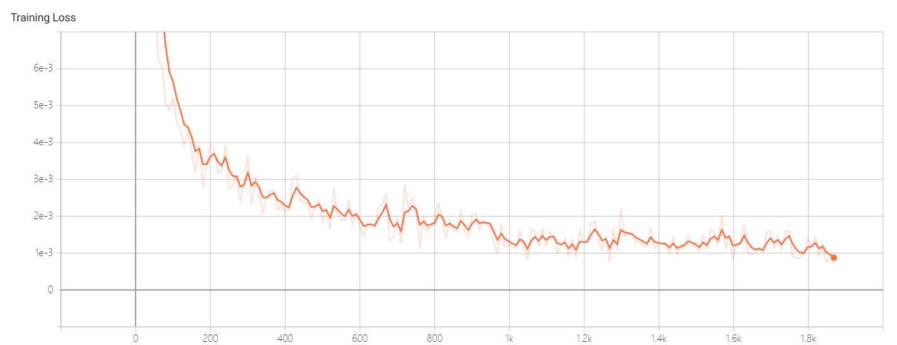

# Lab 1 - 框架及工具入门示例

### 具体步骤

1.	按装依赖包。PyTorch==1.5, TensorFlow>=1.15.0

2.	下载并运行PyTorch仓库中提供的MNIST样例程序。

3.	修改样例代码，保存网络信息，并使用TensorBoard画出神经网络数据流图。

4.	继续修改样例代码，记录并保存训练时正确率和损失值，使用TensorBoard画出损失和正确率趋势图。

5.	添加神经网络分析功能（profiler），并截取使用率前十名的操作。

6.	更改批次大小为1，16，64，再执行分析程序，并比较结果。

7.	【可选实验】改变硬件配置（e.g.: 使用/ 不使用GPU），重新执行分析程序，并比较结果。

## 实验报告

### 实验环境

||||
|--------|--------------|--------------------------|
|硬件环境|CPU（vCPU数目）  &nbsp;&nbsp;&nbsp;&nbsp;&nbsp;&nbsp;&nbsp;&nbsp;&nbsp;&nbsp;Intel(R) i5-9300H @2.40GHz(8)|&nbsp;&nbsp;&nbsp;&nbsp;&nbsp;&nbsp;&nbsp;&nbsp;&nbsp;|
||GPU(型号，数目) &nbsp;&nbsp;&nbsp;&nbsp;&nbsp;&nbsp;&nbsp;&nbsp;&nbsp;&nbsp; &nbsp;&nbsp;Nvidia GeForce RTX 2060(1)
|软件环境|OS版本 &nbsp;&nbsp;&nbsp;&nbsp;&nbsp;&nbsp;&nbsp;&nbsp;&nbsp;&nbsp; &nbsp;&nbsp;&nbsp;&nbsp;&nbsp;&nbsp;&nbsp;&nbsp;&nbsp;&nbsp;&nbsp;&nbsp;&nbsp;&nbsp;&nbsp;&nbsp;&nbsp;&nbsp;Windows 10(64位)
||深度学习框架 python包名称及版本 &nbsp;&nbsp;&nbsp;&nbsp;&nbsp; &nbsp;&nbsp; Pytorch 1.15.0
||CUDA版本    &nbsp;&nbsp;&nbsp;&nbsp;&nbsp;&nbsp;&nbsp;&nbsp;&nbsp;&nbsp; &nbsp;&nbsp;&nbsp;&nbsp;&nbsp;&nbsp;&nbsp;&nbsp;&nbsp;&nbsp;&nbsp;&nbsp;&nbsp;&nbsp;&nbsp;&nbsp;&nbsp;&nbsp; 无
||||

### 实验结果

1. 模型可视化结果截图s
   
|||
|---------------|---------------------------|
| &nbsp; 神经网络数据流图 &nbsp; &nbsp;|&nbsp; &nbsp; &nbsp; &nbsp; &nbsp; &nbsp; &nbsp; &nbsp; &nbsp; &nbsp; &nbsp; &nbsp; &nbsp; &nbsp; &nbsp; &nbsp; &nbsp; &nbsp; &nbsp; &nbsp; &nbsp; &nbsp; |
| &nbsp; 损失和正确率趋势图 &nbsp; &nbsp;||
| &nbsp; 网络分析，使用率前十名的操作 &nbsp; &nbsp;||
||||

2. 网络分析，不同批大小结果比较

|||
|------|--------------|
|批大小 &nbsp;| &nbsp; &nbsp; &nbsp; &nbsp; &nbsp; 结果比较 &nbsp; &nbsp; &nbsp; &nbsp; &nbsp; |
| &nbsp; 1 &nbsp; &nbsp;||
| &nbsp; 16 &nbsp; &nbsp;||
| &nbsp; 64 &nbsp; &nbsp;||
|||
